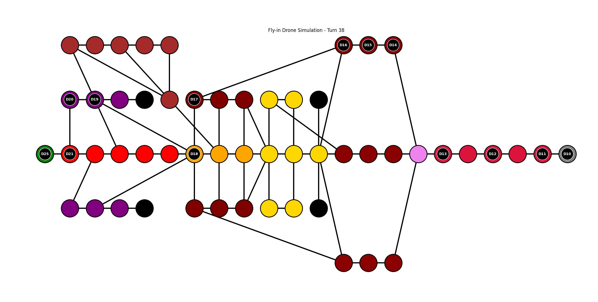

*This project has been created as part of the 42 curriculum by moezzoub.*

# Fly-in

Fly-in is a Python drone-routing simulation project. The goal is to move a fleet of drones from a unique start hub to a unique end hub through a connected graph of zones, while respecting movement costs, blocked zones, zone capacity, connection capacity, and turn-by-turn simulation rules.

The program parses a map file, builds an object-oriented graph model, computes a valid route, simulates drone movement turn by turn, prints the movement log in the required format, and displays a graphical visualization of the network and drone positions.

## Description

The project models a drone transportation network as a graph:

- **Zones** are graph nodes.
- **Connections** are bidirectional graph edges.
- **Drones** start at the `start_hub` and must reach the `end_hub`.
- **Simulation turns** represent discrete time steps.
- **Capacities** prevent too many drones from occupying the same zone or using the same connection at the same time.

The main objective is to deliver all drones in as few turns as possible while keeping the simulation valid.

## Features

- Parses the Fly-in map format.
- Supports `start_hub`, `end_hub`, regular `hub`, and `connection` lines.
- Supports zone metadata:
  - `zone=normal`
  - `zone=blocked`
  - `zone=restricted`
  - `zone=priority`
  - `color=<name>`
  - `max_drones=<positive_integer>`
- Supports connection metadata:
  - `max_link_capacity=<positive_integer>`
- Handles movement costs:
  - `normal`: 1 turn
  - `priority`: 1 turn
  - `restricted`: 2 turns
  - `blocked`: inaccessible
- Uses a weighted shortest-path algorithm.
- Simulates drone movement turn by turn.
- Prints drone movement output using the required `D<ID>-<zone>` format.
- Provides graphical visualization with `matplotlib`.
- Includes linting and type checking through `flake8` and `mypy`.

## Project Structure

```text
.
├── Makefile
├── main.py
├── parser.py
├── requirements.txt
├── visualizer.py
├── maps/
│   ├── README.md
│   ├── easy/
│   ├── medium/
│   ├── hard/
│   └── challenger/
├── models/
│   ├── __init__.py
│   ├── connection.py
│   ├── drone.py
│   ├── graph.py
│   └── zone.py
└── simulation/
    ├── __init__.py
    ├── pathfinder.py
    └── simulator.py
```

## Requirements

- Python 3.10 or later
- `flake8`
- `mypy`
- `matplotlib`

Install the dependencies with:

```bash
make install
```

Or manually:

```bash
python3 -m pip install -r requirements.txt
```

## Instructions

### Run the project

The program expects one map file path as argument:

```bash
python3 main.py <map_file>
```

Example:

```bash
python3 main.py maps/easy/01_linear_path.txt
```

The Makefile `run` rule executes the project with the challenger map:

```bash
make run
```

### Debug the project

```bash
make debug
```

This runs the project with Python's built-in debugger.

### Clean generated files

```bash
make clean
```

This removes Python cache files and mypy cache folders.

### Run linting and type checking

```bash
make lint
```

This runs:

```bash
flake8 .
mypy . --warn-return-any --warn-unused-ignores --ignore-missing-imports --disallow-untyped-defs --check-untyped-defs
```

Optional strict check:

```bash
make lint-strict
```

## Map File Format

A map file describes the drone network.

Example:

```text
nb_drones: 5
start_hub: hub 0 0 [color=green]
end_hub: goal 10 10 [color=yellow]
hub: roof1 3 4 [zone=restricted color=red]
hub: roof2 6 2 [zone=normal color=blue]
hub: corridorA 4 3 [zone=priority color=green max_drones=2]
hub: obstacleX 5 5 [zone=blocked color=gray]
connection: hub-roof1
connection: hub-corridorA
connection: roof1-roof2
connection: roof2-goal
connection: corridorA-goal [max_link_capacity=2]
```

### Rules

- The first required instruction is `nb_drones: <positive_integer>`.
- There must be one unique `start_hub`.
- There must be one unique `end_hub`.
- Zone coordinates must be integers.
- Connections are bidirectional.
- Comments start with `#`.
- Blocked zones cannot be entered.
- Restricted zones require 2 turns to enter.
- Start and end zones are special: multiple drones may start or finish there.

## Simulation Output

Each simulation turn is printed as one line.

Each movement follows this format:

```text
D<ID>-<zone>
```

For drones moving through a restricted connection, the output uses the connection name while the drone is in transit:

```text
D<ID>-<connection>
```

Example:

```text
D1-roof1 D2-corridorA
D1-roof2 D2-tunnelB
D1-goal D2-goal
```

Drones that do not move during a turn are omitted from that line. The simulation ends when all drones reach the end zone.

## Algorithm Choices and Implementation Strategy

### Graph Representation

The graph is implemented manually without graph-specific libraries.

The `Graph` class stores:

- `zones`: a dictionary of zone names to `Zone` objects.
- `connections`: a list of `Connection` objects.
- `neighbors`: an adjacency list mapping each zone name to its connections.
- `start_zone`: the unique starting zone.
- `end_zone`: the unique target zone.

This gives efficient neighbor lookup during pathfinding while keeping the implementation simple and object-oriented.

### Zone Model

Each `Zone` stores:

- name
- coordinates
- zone type
- color
- maximum drone capacity
- current drone count

The zone is responsible for checking whether a drone can enter it. This keeps capacity logic close to the data it protects.

### Connection Model

Each `Connection` stores:

- the two linked zones
- maximum link capacity
- current turn usage

Connections are bidirectional. The simulator checks connection capacity before allowing a drone to move through an edge.

### Pathfinding

The project uses a weighted shortest-path search based on Dijkstra's algorithm.

The path cost is based on the destination zone:

- entering a normal zone costs `1`
- entering a priority zone costs `1`
- entering a restricted zone costs `2`
- blocked zones are ignored

This allows the algorithm to avoid blocked zones and prefer lower-cost paths.

The pathfinder returns a list of `Zone` objects from the start zone to the end zone. If no valid route exists, the program raises a clear error.

### Turn Simulation

The simulator advances in discrete turns.

On each turn:

1. Drones already in transit are advanced first.
2. Available drones try to move to the next valid zone.
3. Zone capacity is checked before entering a zone.
4. Connection capacity is checked before using a connection.
5. Drones that reach the end zone are marked as delivered.
6. Drone movements are printed in the required output format.
7. The visualizer updates drone positions on the graph.

This separation keeps pathfinding and movement scheduling easier to understand.

### Restricted Zones

Restricted zones have a movement cost of `2`. When a drone moves toward a restricted zone, it spends one turn in transit on the connection before reaching the destination.

During this state, the drone has no current zone and is displayed between the two connected zones in the visualizer.

## Visual Representation

The project uses `matplotlib` to display the simulation graphically.

The visualizer shows:

- zones as large colored nodes
- connections as black lines
- drones as labeled markers such as `D1`, `D2`, etc.
- the current simulation turn in the window title
- drones in transit positioned between their source and destination zones

Colors from the map file are used when they are valid matplotlib colors. Invalid or missing colors fall back to gray.

The visual feedback helps the evaluator understand:

- the graph topology
- where drones are located
- how drones move turn by turn
- how restricted-zone movement behaves
- how congestion appears around narrow paths or low-capacity zones

### Graph Visualization Preview

The image below shows an example of the graph rendered with `matplotlib.pyplot`. It helps readers quickly understand how zones, connections, colors, capacities, and drone positions are represented visually.



The visual feedback helps understand:

- the graph topology
- where drones are located
- how drones move turn by turn
- how restricted-zone movement behaves
- how congestion appears around narrow paths or low-capacity zones

## Error Handling

The program validates important invalid states, including:

- missing map file
- invalid number of drones
- duplicate zone names
- missing start zone
- missing end zone
- invalid zone type
- invalid capacity values
- missing zones in connections
- no valid path from start to end
- movement into a full zone
- movement through a full connection

Python context managers are used for file reading to ensure resources are properly managed.

## Performance Notes

The pathfinder uses a priority queue through Python's `heapq` module.

For a graph with `V` zones and `E` connections, the weighted shortest-path search has a typical complexity of:

```text
O((V + E) log V)
```

The simulator then moves drones turn by turn until all drones are delivered. The total runtime depends on:

- number of drones
- selected path length
- zone capacities
- connection capacities
- restricted-zone movement costs
- congestion caused by narrow paths

The provided benchmark maps can be used to compare the number of turns against the subject targets.

## Resources

Useful references for this project:

- Python documentation: https://docs.python.org/3/
- Python `heapq` documentation: https://docs.python.org/3/library/heapq.html
- Python `enum` documentation: https://docs.python.org/3/library/enum.html
- Python type hints documentation: https://docs.python.org/3/library/typing.html
- flake8 documentation: https://flake8.pycqa.org/
- mypy documentation: https://mypy.readthedocs.io/
- matplotlib documentation: https://matplotlib.org/stable/
- Dijkstra's algorithm overview: https://en.wikipedia.org/wiki/Dijkstra%27s_algorithm

## AI Usage

AI assistance was used during development as a support tool for:

- explaining Dijkstra's algorithm
- reviewing parser logic
- identifying possible edge cases
- discussing graph modeling and simulation design

